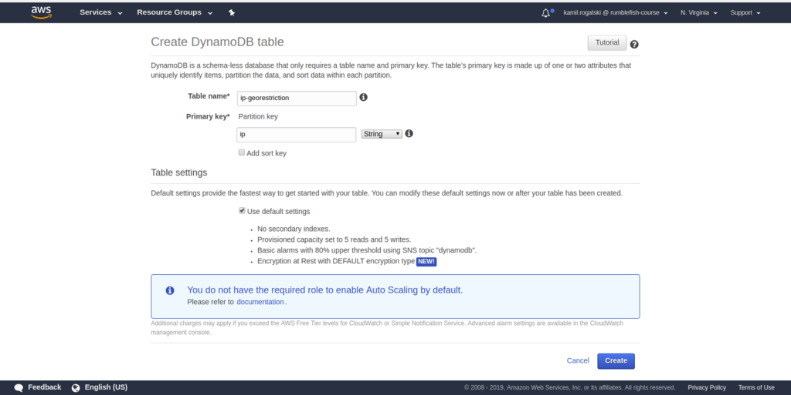

# Custom geo restriction of AWS Cloud Front Distribution using Lambda@Edge

A while ago one of our clients came to us with question if it’ s
possible to block access to their web application for users from
a certain US state. A typical infrastructure of the application
we create at Rumble Fish involves Cloud Front distribution, which
serves compiled frontend files, usually built in React.

Cloud Front offers geo restriction out of box, however, for some
reason it only allows to filter traffic based on country, which was
way too broad in the case at hand. In this article I would like
to present our tiny solution for that request. Our approach leverages
Lambda@Edge to facilitate traffic filtering. To determine if the user
connects from the US state that we want to filter out we used publicly
available list of IP ranges used by ISPs from that state. We’ve stored
these ranges in DynamoDB and check upon request if client’s IP matches
the filter. If it does the users gets redirected to a page explaining
the geo restriction policies of our site. But first let’s start with
the basics.

## What is Lambda@Edge?

Lambda@Edge is a feature in AWS Cloud Platform that allows to run short
functions directly on Edge Locations which directly serve content to the
clients.

Lambda functions can be used to modify CloudFront requests and
responses at the following points:

* After CloudFront receives a request from a viewer (viewer request)
* Before CloudFront forwards the request to the origin (origin request)
* After CloudFront receives the response from the origin (origin response)
* Before CloudFront forwards the response to the viewer (viewer response)

In our scenario of geo restriction we would like to check IP address of the
client and compare with list of restricted address. So “viewer request” event
is the best choice.

# Implementing Lambda@Edge function in Serverless framework

The code of our solution can be found on our public company
[git profile](https://github.com/rumblefishdev/restrict-ip-lambda). It's done
using Serverless framework which we love dearly. If you want to deploy it to
your AWS account you can follow simple steps:

    git clone https://github.com/rumblefishdev/restrict-ip-lambda
    cd restrict-ip-lambda
    npm install
    npx serverless deploy

The stack deploys a Lambda@Edge function in us-east-1 region.

In order to make the CloudFront distribution use it, modify your Cloud Formation
template with the following:

    CloudFront:
      Type: AWS::CloudFront::Distribution
      Properties:
        DistributionConfig:
          ...
            LambdaFunctionAssociations:
              - EventType: viewer-request
                LambdaFunctionARN:
                  Fn::ImportValue: RestrictIpLambdaFunctionQualifiedArn

Please note that the following import will only work if your CloudFront
distribution is also in us-east-1. If you're usually using different AWS region
you will have to type in the ARN of LambdaVersion directly to your
template. Remember that Lambda@Edge functions are required to be deployed in
`us-east-1` region, because this region is where all other region replicate from.

## Loading list of restricted IPs

In our case we have quite few IP address ranges we would like to restrict access
to. We've downloaded the ranges for the US state we needed to block from public lists.
Since we want our restriction mechanism to inflict minimal delay we've found out
that it's best choice to convert all the ranges to the list of IP addreeses.

This way the database query which happens on request time only needs to check
single index to determine if address is blocked, as opposed to checking 2
indexes if we were to store blocked ranges as beginning and end of range.

The ip ranges for the US state we needed to block translated to about 8 million
ip addresses, which is not a huge dataset for DynamoDB. We chose DynamoDB because
of it's quite cheap (about $1,5 a month for our 8M entries) and we can scale it arbitrarly
to accommodate the traffic.

IP table needs only one key: ip which we store as 32 byte integer.

## Loading blocked IPs to DynamoDB

The repository comes with the Python script which does the job. Assuming you
have a text file names `ipc.csv` where each row is an IP address to block you
can load it to DynamoDB using:

    python3 import_ips_from_csv.py ips.csv

# Anatomy of the Serverless app

## serverless.yml

This tiny example is a good occasion to highlight some nice features of
Serverless framework. In this paragraph we go through `serverless.yml` file and
explain responsibility of each section.

### Basic settings

Starting from the top of the file we find:

    service: restrict-ip-lambda
    package:
      individually: true
    plugins:
      - "@silvermine/serverless-plugin-cloudfront-lambda-edge"
    provider:
      name: aws
      region: us-east-1
      runtime: nodejs8.10
      stage: dev

As I mentioned above Lambda@Edge functions need to be deployed in `us-east-1`
region so we hardcode this value in the file.

Also it's worth to explain what
`@silvermine/serverless-plugin-cloudfront-lambda-edge` is for. It's responsible
for configuring the function priviledges to work with Lambda@Edge.
It's adding `"lambdaedge.aws.com"` as Principal of the AWS::Iam::Role created by
the framework and it's allowing this role to replicate the function to Edge
locations.

### Custom priviledges of Lambda@Edge function

Following further down we find:

    iamRoleStatements:
    -
      Effect: Allow
      Action:
        - ssm:GetParameter
      Resource:
        Fn::Join:
          - ""
          -
            - "arn:aws:ssm"
            - ":"
            -
              Ref: AWS::Region
            - ":"
            -
              Ref: AWS::AccountId
            - ":parameter"
            -
              Ref: RestricFlagParam
    -
      Effect: Allow
      Action:
        - dynamodb:GetItem
      Resource:
        - Fn::GetAtt: [RestrictIpTable, Arn]

Above block grants 2 priveledges that our function needs.

First one allows it to read a secret settings that when passed in query string
bypasses the restriction mechanism. The initial value of this parameter is set
in `config.dev.yml` file.

Second priveledges grants our lambda function read access from the DynamoDB
table in which we store the restricted IP addresses.

### Custom settings

Next we find this block:

    custom:
      stage: ${opt:stage, self:provider.stage}

We always have these lines in every Serverless application we create. This sets
`${self:custom.stage}` to be taken from command line arguments passed as
`--stage STAGE` but takes the default value from `provider.stage` where we set
it to `dev`.

Following down we have:

      config: ${file(./config.${self:custom.stage}.yml)}

This line loads the config file, which name include the name of the stage. This
allows us to deploy application to multiple environments with different
settings. The app repository comes with the a config file names `config.dev.yml`
which looks as follows:

    RestrictFlagPath: /develop/shared/restrict_flag
    RestrictFlagPhrase: canIGetInPlease

Combination of above allows us to later refer to environment settings using for
example: `${self:custom.config.RestrictFlagPath}`.

### Function definition

Below we can find this block:

    functions:
      restrictIp:
        handler: restrictIp.handler
        memorySize: 128
        timeout: 3
        package:
          exclude:
            - ./**
          include:
            - restrictIp.js

This part defines the only lambda function defined by the app. It specifies that
it's implementation is to be used in `handler` variable exported from
`restrictIp.js` file. The `memorySize` and `timeout` settings are mandatory for
Lambda@Edge functions.

The `package` section specifies which files should be included in Lambda source.

### Custom resources definitions

Finally we can to a section which describes 2 resources that are used to control
the behavior of our funciton.

    resources:
      Resources:
        RestricFlagParam:
          Type: AWS::SSM::Parameter
          Properties:
            Name: ${self:custom.config.RestrictFlagPath}
            Description: 'Restrict flag to bypass filter by restricted customers'
            Type: String
            Value: ${self:custom.config.RestrictFlagPhrase}

This part defines a secret query parameter which allows user to bypass the check
(see the implementation in `restrictIp.js` for details.

        RestrictIpTable:
          Type: AWS::DynamoDB::Table
          Properties:
            AttributeDefinitions:
              -
                AttributeName: ip
                AttributeType: N
            KeySchema:
              -
                AttributeName: ip
                KeyType: HASH
            ProvisionedThroughput:
              ReadCapacityUnits: 15
              WriteCapacityUnits: 1
            TableName: restrict-ip-table

This is a definition of DynamoDB table. We define one attribute `ip` of
`N(umber)` type and create a `HASH` index on this field.

## Lambda@Edge function implementation - restrictIp.js

Now let's brake down the implementation of our filtering mechanism into pieces.

Starting from the top we have these:

    'use strict'

    const QS = require('querystring')
    const AWS = require('aws-sdk')
    const ssm = new AWS.SSM({ region: 'us-east-1' })
    const dynamodb = new AWS.DynamoDB({ region: 'us-east-1' })

Our service uses SSM and DynamoDB services. At first site a careful reader may
wonder why we need to specify `{ region: 'us-east-1' }` in service
configuration. This is specific to the fact that we are dealing with Lambda@Edge
function which gets replicated to Edge location. When our distribution receives
request from other location it needs to know from which region it should request
it's services.

### Implementation

    exports.handler = (event, context, callback) => {
      const request = event.Records[0].cf.request
      checkIpTable(request, callback)
    }

    const TableName = 'restrict-ip-table'

    async function checkIpTable(request, callback) {
      const ipnumber = ip2int(request.clientIp).toString()
      let data
      try {
        data = await dynamodb.getItem({
          Key: { ip: { N: ipnumber } },
          TableName
        }).promise()
      } catch (err) {
        console.error(err)
        restrictedResponse(request, callback)
        return
      }
      if (!data.hasOwnProperty('Item')) {
        callback(null, request)
        return
      } else {
        await checkRestrictFlag(request, callback)
      }
    }

The `handler` function is our entry point defined in `serverless.yml`. This
function converts the IP address of the client to 32-bit integer and looks up
the DynamoDB table.

If entry is found it calls to `checkRestrictFlag` that looks as follows:

    async function checkRestrictFlag(request, callback) {
      const params = QS.parse(request.querystring)
      if (!params.ipr) {
        return restrictedResponse(request, callback)
      }
      const ssmParams = { Name: '/develop/shared/restrict_flag', WithDecryption: true }
      let data
      try {
        data = await ssm.getParameter(ssmParams).promise()
      } catch (err) {
        console.error(err)
        restrictedResponse(request, callback)
      }
      if (data.Parameter.Value !== params.ipr) {
        restrictedResponse(request, callback)
      } else {
        callback(null, request)
      }
    }

This function checks the query string and compares the value of `ipr` parameter
to the value stored in Paramater Store. If the value matches the filter
mechanism lets the user through and blocks him otherwise.

### Restriction mechanism

In case the user gets restricted it has at effect of applying the following
modification to the request made to origin:

    function restrictedResponse(request, callback) {
      request.uri = '/restricted.html'
      callback(null, request)
    }

This has an effect of returning to the client the content of `restricted.html`
file instead of the path the he requested. We've made this page to present the
information about restrictions to the user.

# Debugging Lambda@Edge function

Ok, so now that we have function deployed and we've explained how it's build,
let's see how we can debug it. Assuming you've followed all the steps the
function is attached to a Cloud Front distribution.

Every time it gets requested you will see some log output in Cloud Watch. The
function will run in the Edge location specific to the place from which you make
the request. For requests done from central Europe the requests get served from
`eu-central-1` region.

Cloud Front will automatically replicate our function between the regions and
run it in edge location. You should look for a Log Group named
`/aws/lambda/us-east-1.restrict-ip-lambda-dev-restrictIp` in a region
geographically closest to you.

# Summary

The takeaways from this arcticle:

* Using Geo Restriction as an example we've demonstrated how Lamda@Edge can modify
  behavior of Cloud Front distribution.
* Lambda@Edge functions can access resources in `us-east-1` and access storage
  in DynamoDB table.
* It's most convinient to use Serverless framework to create Lambda functions,
  AWS resources and tying them together.
* We've demonstrated few tricks we typically use in our development work at
  Rumble Fish.
